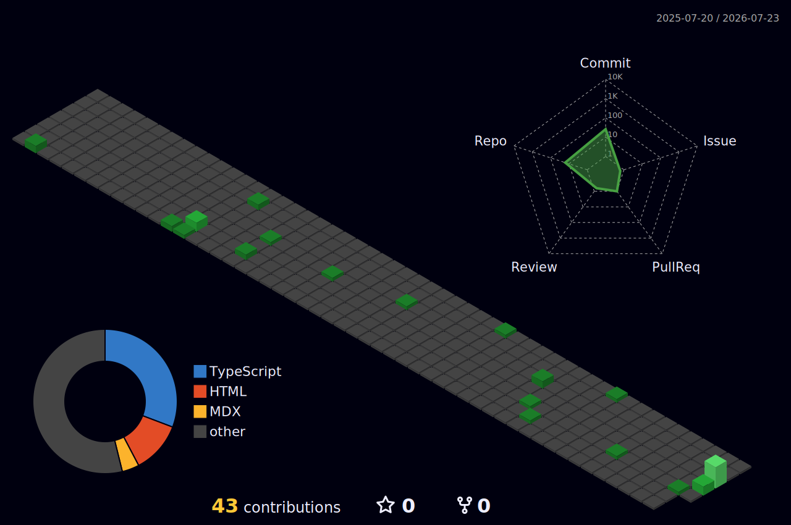

<!-- BANNER CHÍNH ĐỘNG (Bạn có thể thay link GIF này bằng cái bạn thích) -->


<div align="center">
<div align="center">
  <h3>🏙️ My Commit City (3D Cyberpunk View)</h3>
  
</div>
<!-- HIỆU ỨNG GÕ CHỮ (Màu xanh neon đậm chất IT) -->
<div align="center">
  <a href="https://git.io/typing-svg">
    
  </a>
</div>

<br/>
<!-- Ví dụ Badge Kỹ năng -->


<!-- Badge GitHub Stats -->
[](https://git.io/streak-stats)
### 🛰️ Hệ Thống Module Taka (JSON View)

```json
{
  "name": "Lê Thành Thái (aka Taka)",
  "vitals": {
    "age": "CalculatedAtRunTime",
    "loc": "Đà Lạt, VN 🇻🇳"
  },
  "modules": [
    {
      "code": "Web3D",
      "status": "Active",
      "main_projects": ["TakaVision"]
    },
    {
      "code": "GameDev",
      "status": "Idle",
      "main_projects": ["The Call Beneath"]
    },
    {
      "code": "AI_ML",
      "status": "Researching",
      "focus": ["Computer Vision", "YOLO"]
    }
  ],
  "learning_loop": [
    "Design Patterns",
    "Teaching Python/JS",
    "Advanced WebGL"
  ]
}
