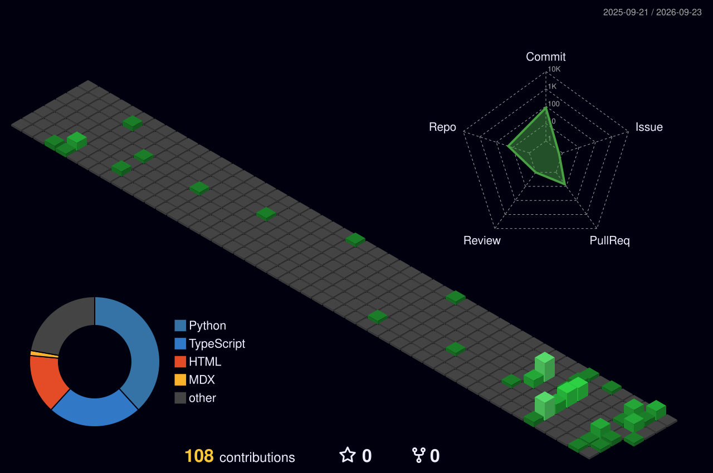

<!--
  README.md — Lê Thành Thái (Taka) · github.com/ThaiTaka
  Redesigned theme: "Tokyo Night" gradient (indigo/blue/purple)
  Toàn bộ widget bên dưới đều là ảnh SVG public, không cần build gì thêm,
  trừ phần "profile-3d-contrib" — cái này bạn đã có Action tự chạy rồi nên mình giữ nguyên.
-->

 

  

 

## 👋 Về mình

Xin chào, mình là **Lê Thành Thái**, hay còn gọi là **Taka**. Hiện mình là sinh viên CNTT lớp **CTK46B**, Trường Đại học Đà Lạt. Mình thích xây dựng những sản phẩm nằm giữa lập trình và đồ họa — từ web 3D, game, cho tới các dự án nhỏ về AI/Computer Vision.

| Module | Trạng thái | Đang làm gì |
|:---:|:---:|:---|
| 🌐 **Web3D** |  | TakaVision |
| 🎮 **GameDev** |  | The Call Beneath |
| 🤖 **AI / ML** |  | Computer Vision · YOLO |

🔁 **Đang học thêm:**

 

## 🛠️ Tech Stack

  

 

## 🏙️ Contribution Grid

  

> Grid này tự cập nhật mỗi ngày qua GitHub Action [`yoshi389111/github-profile-3d-contrib`](https://github.com/yoshi389111/github-profile-3d-contrib) đã cấu hình sẵn trong repo — không cần đụng vào.

 

## 📊 GitHub Stats

 

 

## 🏆 Trophies

  

 

  

